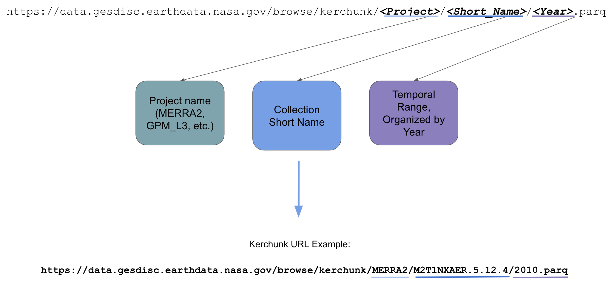

# THREDDS to Virtualized Datasets
## Updated 5/29/26

### Introduction
In compliance with NASA's [Open Data Policy](https://www.earthdata.nasa.gov/engage/open-data-services-software-policies) and NASA’s Earth Science Data Systems ([ESDS](https://www.earthdata.nasa.gov/about)) Program’s strategic vision, The GES DISC THREDDS Data Service (TDS) is being discontinued in favor of virtualized data stores. This document outlines the capabilities and access methods of virtual data stores, specifically [Kerchunk](https://fsspec.github.io/kerchunk/) files, as a temporary replacement for the TDS service.

### What are [Virtual Data Stores](https://nasa-impact.github.io/virtual-stores-feasibility-report/)?
A typical workflow for subsetting data involves a remote server and a client, where the remote server ([OPeNDAP](https://www.earthdata.nasa.gov/data/tools/opendap)) handles a client’s subsetting request before returning the results in its own data format. Virtual data stores replace this client-server pattern by allowing users to remotely access specific chunks of data across multiple granules and return them as a dataset on their local compute instance. It is _not_ required to be in the ["us-west-2" AWS region](https://docs.aws.amazon.com/global-infrastructure/latest/regions/aws-regions.html) to access virtualized chunks.

This approach allows users to “virtualize” large collections of granules along multiple dimensions into a “data cube,” similar to [Zarr](https://zarr.dev/), which is also cloud-optimized. The performance of this access method therefore depends on the resources available to the user, particularly compute capacity and internet speed.

### How are GES DISC Kerchunk Files Created and Accessed?
To build virtualized datasets of NASA Earthdata, [OPeNDAP](https://www.earthdata.nasa.gov/data/tools/opendap) metadata files are parsed to identify the locations of chunks within granules using the “[virtualizarr](https://virtualizarr.readthedocs.io/en/stable/)” Python library. These mappings can then be saved to disk using the “Kerchunk” Python library. As long as the user has an internet connection and valid Earthdata credentials, these “Kerchunk” files (saved in a [Parquet](https://parquet.apache.org/) format) can be accessed using the “Xarray” Python library, allowing users to potentially access decades of data through only a few URLs.

### Important Notes
- _**GES DISC Kerchunk files are a static, temporary replacement for the TDS service, and will not support forward-streaming**_, meaning they only contain data up to a certain point in time. Future work includes discontinuing static Kerchunk files in favor of Icechunk stores, which would allow virtualized chunks to be dynamically updated in a forward-streaming configuration. Guidance for this transition will be created and shared through the [gesdisc-tutorials](https://github.com/nasa/gesdisc-tutorials) GitHub repository.
- _**GES DISC Kerchunk files are not published on the [Common Metadata Repository (CMR)](https://www.earthdata.nasa.gov/about/esdis/eosdis/cmr)**_ and must be manually formatted and entered into Python scripts.
- _**User resources, particularly Internet bandwidth, memory, and compute cores, determine the performance of GES DISC Kerchunk file data access.**_ As a result, performance may degrade when resources are limited, and alternative forms of data access may need to be considered (i.e., [Cloud OPeNDAP](https://github.com/nasa/gesdisc-tutorials/blob/main/notebooks/How_to_Search_and_Load_Cloud_OPeNDAP.ipynb) or the [GES DISC Subsetter API](https://github.com/nasa/gesdisc-tutorials/blob/main/notebooks/How_to_Subset_and_Download_L234_Data_Using_Python.ipynb)).

### Kerchunk File URL Structure
Kerchunk file URLs utilize the following structure:

### Available Collections
The following collections (complete with all variables) are listed below:
| Project | Short Name and Version | Kerchunk File Size | Year Range |
|--------|-------------------------|---------------------|------------|
| GLDAS | GLDAS_NOAH025_3H.2.1 | 21.2 MB | 2000-01-01 - 2025-12-31 |
| GPM_L3 | GPM_3IMERGDF.07 | 2.3 MB | 1998-01-01 - 2025-12-31 |
| GPM_L3 | GPM_3IMERGDL.07 | 2.3 MB | 1998-01-01 - 2025-12-31 |
| MERRA2 | M2T1NXAER.5.12.4 | 1.5 GB | 1983-01-01 - 2025-12-31 |
| MERRA2 | M2T1NXFLX.5.12.4 | 1.5 GB | 1983-01-01 - 2025-12-31 |
| MERRA2 | M2T1NXRAD.5.12.4 | 1.1 GB | 1983-01-01 - 2025-12-31 |
| MERRA2 | M2T1NXSLV.5.12.4 | 1.4 GB | 1983-01-01 - 2025-12-31 |
| MERRA2 | M2T1NXAER.5.12.4 | 12 MB | 1983-01-01 - 2025-12-31 |

### Tutorials
Please click the following links for Jupyter Notebook tutorials on accessing GES DISC Kerchunk Files:
- [How to Access GES DISC Kerchunk Files Using Python](../

### Additional Resources
- [NASA Virtual Stores Feasibility Report](https://nasa-impact.github.io/virtual-stores-feasibility-report/)
- [NASA PO.DAAC Kerchunk File Tutorials](https://podaac.github.io/tutorials/quarto_text/UsingVirtualDatasets.html)

### Questions?
Please post your questions on the [Earthdata Forum](https://forum.earthdata.nasa.gov/) for community feedback and subject matter expert answers, or contact the Help Desk (via email at `gsfc-dl-help-disc@mail.nasa.gov`) for any questions about cloud data and services.
